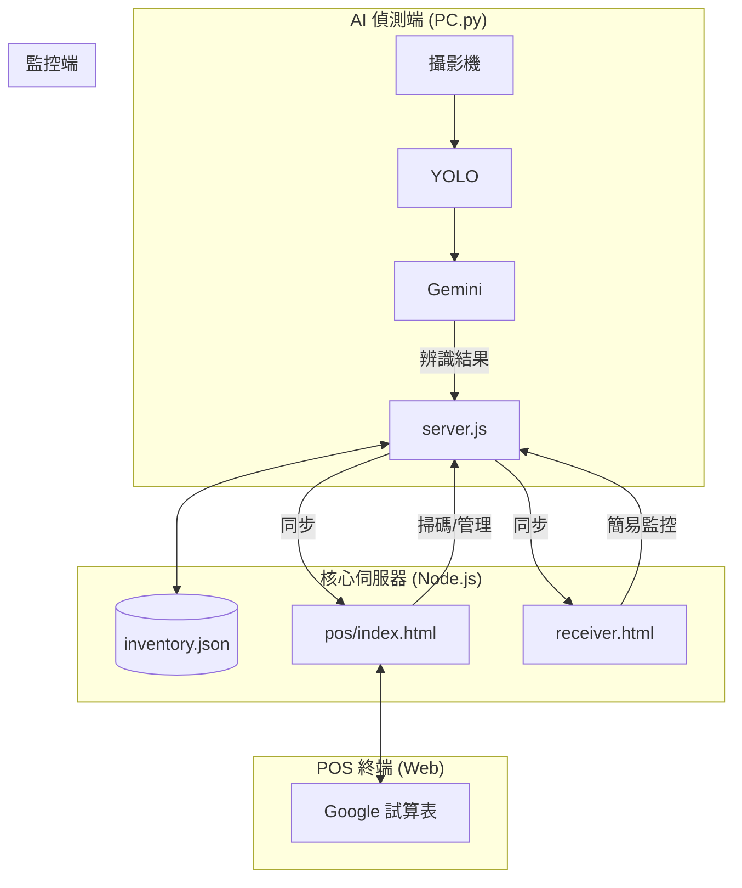

# 智慧庫存管理系統 (Smart Inventory System)

這是一套整合了 **AI 影像辨識 (YOLO + Gemini)**、**POS 掃碼系統** 與 **即時網頁同步 (Socket.IO)** 的全方位智慧零售解決方案。

---

## 🏗️ 系統架構



### 核心功能
1.  **AI 自動入庫**：攝影機偵測物品，自動增加庫存。
2.  **POS 掃碼管理**：支援條碼槍，可手動進出貨，資料即時同步。
3.  **雙向同步**：AI 看到的變化會立刻反映在 POS 上；POS 的操作也會影響 AI 的計數基準。
4.  **Google Sheets 整合**：POS 支援將資料備份至 Google 試算表。

---

## 🚀 快速開始

### 1. 安裝依賴
請進入 `final_project` 資料夾：
```bash
npm install
pip install ultralytics google-generativeai python-socketio websocket-client opencv-python pillow numpy
```

### 2. 啟動伺服器
```bash
node server.js
```
伺服器啟動後，會顯示您的 IP 位址。

### 3. 啟動 AI 偵測 (可選)
```bash
python PC.py
```

### 4. 開啟操作介面
*   **POS 系統 (推薦)**：瀏覽器開啟 `http://localhost:3000/pos/index.html`
*   **簡易監控**：瀏覽器開啟 `http://localhost:3000/receiver.html`

---

## 💡 使用情境範例

**情境一：自動販賣**
1. 顧客從架上拿走一瓶飲料。
2. `PC.py` 偵測到物品離開 -> 通知 Server。
3. POS 系統上的庫存自動 -1。

**情境二：補貨**
1. 店員使用 POS 系統，掃描條碼進行進貨。
2. POS 送出更新 -> Server 更新資料庫。
3. 系統紀錄目前的庫存量，作為 AI 偵測的基準。

---

## 🔧 設定調整
*   **API Key**：編輯 `PC.py` 修改 Gemini API Key。
*   **POS 設定**：在 POS 介面右上角點選「設置」，可設定 Google Sheets 連結。